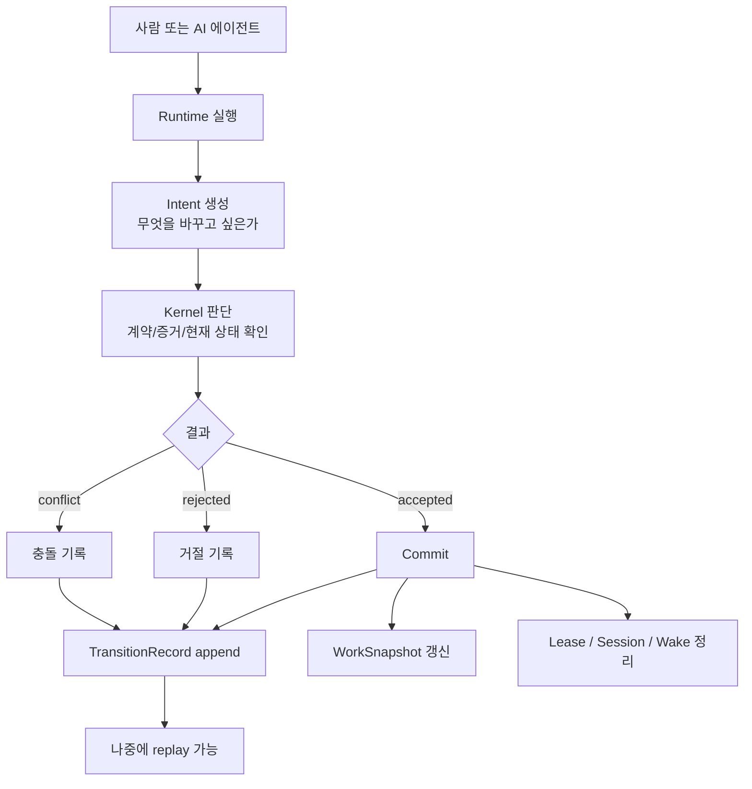
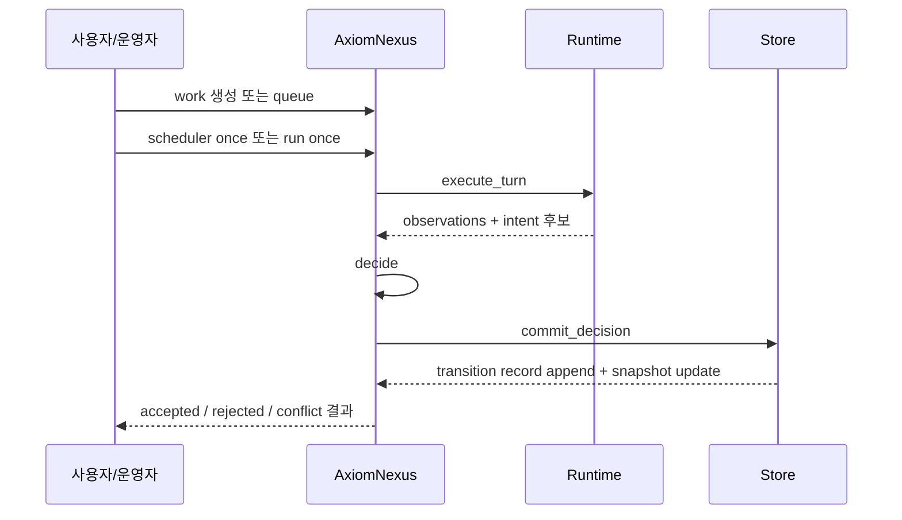

# AxiomNexus 전체 시스템을 한 장 그림으로 이해하는 설명

이 문서는 **AxiomNexus가 무엇이고, 어떻게 작동하며, 실제로 어디에 쓰이는지**를  
한 장 그림처럼 이해할 수 있도록 만든 설명이다.

핵심만 먼저 말하면:

> **AxiomNexus는 AI나 사람이 제안한 코드 작업 변경을, 계약과 증거를 기준으로 판단하고 기록하는 시스템**이다.

조금 더 쉽게 말하면:

> **코드를 바꿔도 되는지 확인해주는 심판 + 기록관**

---

# 1. 한 장 그림



이 그림을 아주 단순하게 읽으면 된다.

1. 누군가 작업을 한다  
2. 변경하고 싶다는 제안을 낸다  
3. 시스템이 검사한다  
4. 승인되면 반영하고 기록한다  
5. 거절돼도 기록은 남긴다  

---

# 2. 이 시스템이 왜 필요한가

AI가 코드를 수정한다고 생각해보자.

AI가 이런 일을 할 수 있다.

- 버그 수정
- 테스트 보완
- 문서 갱신
- 리팩터링
- 작은 기능 추가

문제는 여기서 생긴다.

## 문제 1 — AI가 바꿨는데 왜 바뀌었는지 모른다

예:

- 로그인 버그를 고쳤다
- 테스트도 같이 수정했다
- 그런데 왜 승인됐는지 모른다
- 나중에 문제가 생겨도 추적이 어렵다

## 문제 2 — AI가 마음대로 바꾸면 위험하다

예:

- 코드를 7개 파일 수정했다
- 테스트는 실패했다
- 그런데 상태가 이미 바뀌어 버렸다

## 문제 3 — 사람도 결국 같은 문제를 겪는다

사람이 하든 AI가 하든 결국 필요한 것은 같다.

- 누가 바꾸려 했는가
- 왜 허용됐는가
- 어떤 증거가 있었는가
- 실제 상태가 어떻게 변했는가

AxiomNexus는 바로 이 문제를 해결하려고 만든다.

---

# 3. 한 줄 정의

AxiomNexus를 가장 짧게 정의하면:

> **코드 작업 상태 전이를 승인하고 기록하는 control plane**

조금 더 풀면:

- AI나 사람이 어떤 변경을 **제안**한다
- 시스템이 그 변경을 **판단**한다
- 결과를 **기록**한다
- 승인되면 현재 상태를 **업데이트**한다

---

# 4. 가장 중요한 3단계

AxiomNexus의 중심은 딱 이것이다.

```text
Intent → Decide → Commit
```

각 단계를 쉽게 풀어보자.

## 4.1 Intent

Intent는 아주 간단하다.

> "이 작업을 이렇게 바꾸고 싶습니다"

예:

- bug를 fixed로 바꾸고 싶다
- 테스트 통과 후 상태를 completed로 바꾸고 싶다
- note를 남기고 patch를 적용하고 싶다

즉, **변경 제안서**다.

---

## 4.2 Decide

이제 시스템이 판단한다.

질문은 대체로 이런 식이다.

- 지금 이 work를 바꿔도 되는가?
- lease를 가진 주체가 맞는가?
- revision 충돌은 없는가?
- 계약(contract)을 만족하는가?
- 증거(evidence)가 충분한가?

판단 결과는 보통 셋 중 하나다.

- `accepted`
- `rejected`
- `conflict`

즉, **심판의 판정**이다.

---

## 4.3 Commit

accepted라면 실제 반영한다.

반영은 단순해야 한다.

- 기록 남김
- 현재 상태 갱신
- 관련 세션/lease/wake 정리

핵심은 이것이다.

> **어떤 경우든 기록은 남는다**

승인돼도 기록  
거절돼도 기록  
충돌나도 기록  

그 기록이 바로 `TransitionRecord`다.

---

# 5. 주요 구성요소를 일반인 눈높이로 설명

## 5.1 Work

Work는 “해야 할 일”이다.

예:

- 로그인 버그 수정
- 테스트 깨진 것 복구
- 문서 갱신

AxiomNexus는 이 Work의 상태를 관리한다.

---

## 5.2 Lease

Lease는 “지금 이 작업을 누가 맡고 있는가”를 뜻한다.

비유하면:

> **작업 열쇠**

한 work를 여러 주체가 동시에 바꾸면 혼란이 생긴다.  
그래서 누가 현재 작업권을 갖는지 관리한다.

---

## 5.3 Session

Session은 “같은 작업을 계속 이어서 하는 흐름”이다.

예:

- AI가 같은 작업을 이어서 진행한다
- 이전 문맥을 이어서 쓴다
- 다시 시작할지, 이어갈지 판단한다

즉:

> **작업 기억의 연속성**

---

## 5.4 Wake

Wake는 “이 작업 다시 봐야 함” 신호다.

예:

- 다른 변경 때문에 이 work를 다시 점검해야 한다
- 새로운 이벤트가 발생했다
- 대기 중인 작업을 다시 깨워야 한다

즉:

> **다시 실행하라는 신호**

---

## 5.5 TransitionRecord

이건 가장 중요하다.

TransitionRecord는:

- 누가
- 무엇을
- 왜
- 어떤 증거로
- 어떤 결과로
- 언제 바꾸려 했는지

를 남기는 기록이다.

즉:

> **이 시스템의 진짜 원본 장부**

현재 화면에 보이는 상태보다  
이 장부가 더 중요하다.

---

# 6. 현재 상태와 기록의 차이

많이 헷갈리는 부분이라 쉽게 설명하겠다.

## 현재 상태
예:

- work 42
- status = completed
- rev = 9

이건 “지금 보이는 결과”다.

## 기록
예:

- rev 5에서 bug fix intent 제출
- accepted
- rev 6으로 증가
- 이후 테스트 보강
- accepted
- rev 7
- 문서 갱신
- accepted
- rev 8
- final verification
- accepted
- rev 9

이건 “어떻게 여기까지 왔는가”다.

AxiomNexus는 단순히 현재 상태만 보는 게 아니라,  
**여기까지 오게 된 과정 전체를 보존**한다.

---

# 7. 실제 사용 흐름

실제로는 보통 이런 순서로 쓴다.



이걸 말로 풀면:

1. 운영자가 work를 만든다  
2. 실행을 시킨다  
3. runtime이 실제로 작업한다  
4. 작업 결과를 바탕으로 intent가 나온다  
5. 시스템이 판단한다  
6. 저장소가 기록하고 상태를 갱신한다  

---

# 8. 실제 명령어 감각으로 보기

예를 들면 이런 흐름이다.

## 서버 실행

```bash
axiomnexus serve
```

## queue에 쌓인 작업 한 번 처리

```bash
axiomnexus scheduler once
```

이건 운영용이다.

> “지금 처리할 일 하나 꺼내서 실행해”

## 특정 run 하나만 정확히 실행

```bash
axiomnexus run once 42
```

이건 진단용이다.

> “42번 실행 건을 정확히 한 번 돌려봐”

즉 역할은 이렇게 나누면 가장 이해하기 쉽다.

- `scheduler once` = 운영용 자동 경로
- `run once <id>` = 디버깅/재현/스모크 테스트용 경로

---

# 9. 이 시스템이 아닌 것

헷갈리기 쉬워서 분명히 적는다.

AxiomNexus는 이것이 아니다.

- Git 대체품
- CI/CD 전체 시스템
- 회사 운영 시스템
- Paperclip 전체 복제본
- 범용 workflow 엔진
- 일반적인 프로젝트 관리 툴

AxiomNexus는 이것이다.

- 코드 작업 상태 전이 커널
- AI 작업 승인 시스템
- 계약 기반 변경 판단 시스템
- append-only 작업 장부

---

# 10. Paperclip와의 관계

Paperclip를 따라가다가 범위가 커지기 쉬운데,  
핵심만 가져와야 한다.

가져올 만한 것:

- 실행 단위가 분명해야 한다
- 세션이 이어져야 한다
- 작업 변경은 기록 가능해야 한다
- 나중에 왜 승인됐는지 추적 가능해야 한다

가져오면 안 되는 것:

- 큰 회사 운영 표면 전체
- goals / budgets / org chart / membership 같은 넓은 제품 범위
- “회사를 AI가 통째로 운영한다”는 수준의 과도한 확장

즉:

> **Paperclip의 철학 일부는 참고할 수 있지만, 제품 표면은 따라가면 안 된다**

---

# 11. 이 프로젝트를 실제로 언제 쓸 수 있나

## 지금 가능한 용도

내부 preview / dogfood

예:

- 팀 내부에서 AI 작업을 한 번씩 검증
- queue된 work를 하나씩 처리
- 승인/거절/충돌 흐름을 반복 검증
- replay로 상태 재구성 확인

즉:

> **이미 내부에서 써보며 프로세스를 다듬는 단계에는 들어갈 수 있다**

## 아직 더 필요한 것

stable/final 전에 필요한 것:

- smoke가 핵심 증거를 직접 검증
- release evidence 자동 저장
- operator path 문구/운영 방식 완전 통일
- 이후 버전에서 PostgreSQL adapter 추가

---

# 12. 정말 쉽게 요약

AxiomNexus를 한 문장으로 다시 말하면:

> **AI나 사람이 낸 코드 변경 제안을, 규칙에 따라 승인하고 기록하는 시스템**

조금 더 쉬운 비유로 말하면:

> **코드 변경용 은행 서버**

사람이나 AI가 ATM처럼 요청을 넣으면,  
AxiomNexus가 확인하고,  
허용되면 상태를 바꾸고 장부에 남긴다.

---

# 13. 기억해야 할 핵심 문장 5개

1. **AxiomNexus는 제안된 코드 변경을 판단하는 시스템이다.**
2. **중심 흐름은 Intent → Decide → Commit 이다.**
3. **현재 상태보다 TransitionRecord가 더 중요하다.**
4. **이 시스템은 Paperclip 전체 복제본이 아니다.**
5. **지금 목표는 크게 키우는 것이 아니라 작고 강하게 완성하는 것이다.**

---

# 14. 한눈에 보는 최종 요약 그림

```text
[사람 / AI]
    │
    ▼
[Runtime 실행]
    │
    ▼
[Intent]
    │  "이렇게 바꾸고 싶습니다"
    ▼
[Decide]
    │  "정말 바꿔도 되는가?"
    ▼
[Commit]
    │  "기록하고 현재 상태 반영"
    ▼
[TransitionRecord + WorkSnapshot]
```

이 그림 하나만 이해하면,  
AxiomNexus의 본질은 거의 다 이해한 것이다.
