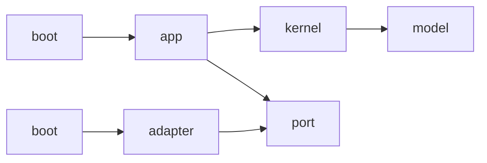
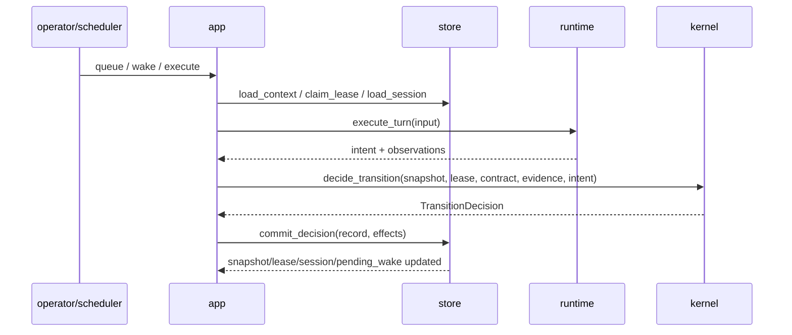

# 청사진

## 정적 구조



상위 모듈은 아래 여섯 개만 둔다. [R2]

```text
src/
  lib.rs
  main.rs
  boot/
  model/
  kernel/
  app/
  port/
  adapter/
```

---

## 책임 분해

### `model`
canonical data contract만 둔다. [R2][R3][R7][R8][R9]

- ids / enums / structs
- schema derive
- 얕은 invariant constructor

금지:
- DB I/O
- runtime 호출
- async
- process spawn

### `kernel`
pure decision rules만 둔다. [R2]

- claim rules
- wake merge
- session advance
- decision evaluation
- snapshot patch

금지:
- trait object
- DB / file / process I/O

### `app`
use-case orchestration만 둔다. [R2][R3]

- context load
- execute_turn orchestration
- evidence assembly
- kernel 호출
- store commit

### `port`
외부 경계 trait만 둔다.

- `StorePort`
- `RuntimePort`
- `ClockPort`
- `BlobPort` (optional)

### `adapter`
실제 구현만 둔다.

- `adapter::surreal`
- `adapter::postgres` *(later)*
- `adapter::coclai`
- `adapter::http`
- `adapter::sse`
- `adapter::clock`
- `adapter::fs`

### `boot`
config / wiring / CLI entrypoint만 둔다.

---

## 최종 control flow



핵심은 다음 두 문장이다.

1. runtime은 **intent와 observations**를 반환한다. [R4]
2. 최종 판정은 kernel이 하고, 최종 반영은 store가 한다. [R1][R2]

---

## Runtime boundary 최종형

현재 저장소는 `RuntimePort::execute_turn`을 가지고 있고, 이번 리팩터링에서 아래 local observation을 같은 turn contract로 수렴시킨다. [R4][R5]

- current_dir
- observe_changed_files
- run_gate_command

지금 canonical 경계에서는 이 셋이 `execute_turn`의 `gate_plan` / `observations`로 흡수된다.

### 이유
- process / filesystem / cwd 관측은 모두 runtime turn의 일부다.
- 별도 `WorkspacePort`를 두면 한 turn에서 수집된 증거가 경계 밖으로 찢어진다.
- commit 직전까지 필요한 관측이 한 envelope로 닫히지 않는다.

### 최종형 원칙
- runtime은 local action + local observation을 모두 책임진다
- kernel은 policy verdict만 책임진다
- store는 authoritative commit만 책임진다

---

## Store boundary 최종형

`StorePort`는 CRUD 모음이 아니라 **semantic operation contract**다. [R2][R6]

핵심 연산은 아래 네 묶음으로 나뉜다.

1. **control-plane mutation**
   - `claim_lease`
   - `load_context`
   - `commit_decision`
   - `merge_wake`

2. **runtime support**
   - `load_runtime_turn`
   - `load_session`
   - `save_session`
   - `mark_run_running`
   - `mark_run_completed`
   - `mark_run_failed`
   - `record_consumption`

3. **replay / export**
   - `list_work_snapshots`
   - `load_transition_records`
   - `export_state`
   - `import_state`

4. **query read-model**
   - board / work / agent / run / activity

---

## 최종 public surface

현재 저장소는 CLI `migrate`, `doctor`, `contract check`, `serve`, `replay`, `export`, `import` 를 이미 명시한다. [R1]  
최종형에서도 이 표면은 유지한다.

자세한 API는 `04-API-SURFACE.md`를 본다.

---

## 구현 전략 요약

1. **port contraction 먼저**
2. **IDC kernel freeze**
3. **Surreal adapter closure**
4. **runtime evidence closure**
5. **API / replay / observability**
6. **triad bridge**
7. **PostgreSQL adapter later**

이 순서가 가장 단순하다.  
이 순서는 현재 저장소의 active docs와도 충돌하지 않는다. [R1][R2][R11][R12]
